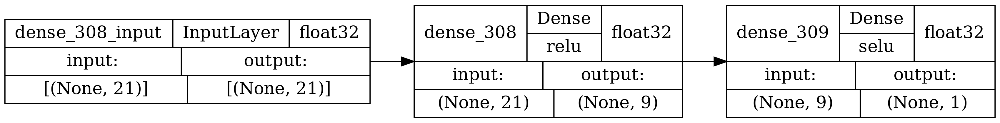

# nn-ys
Нейронная сеть для предсказания предела текучести стали после горячей прокатки

      

## Описание

Данный репозиторий содержит нейросетевую модель на основе многослойного перцептрона. Модель состоит из 3 слоех:
1. Входной слой с 21 нейронами на входе и выходе;
2. Скрытый слой с 21 нейронами на входе и 9 нейронами на выходе. Функция активации данного слоя - relu;
3. Выходной слой с 9 нейронами на входе и 1 нейроном на выходе (предсказанное значение предела текучести). Функция активации данного слоя - selu;

      

Сеть построена на массиве данных, состоящем из 21 входного параметра (16 параметров - химический состав металла, 2 параметра - технологические параметры, 3 параметра - геометрические параметры заготовки и готового изделия).
Таблица 1. Входы сети
| №  |      Параметр      | Минимальное значение | Максимальное значение | Среднее значение |
|:--:|:------------------:|:--------------------:|:---------------------:|:----------------:|
| 1  |  Содержание С, %   |        0,0390        |         0,1140        |       0,0554     |
| 2  |  Содержание Mn, %  |        1,2580        |         1,6000        |       1,4771     |
| 3  |  Содержание Si, %  |        0,1500        |         0,4470        |       0,2000     |
| 4  |  Содержание S, %   |        0,0001        |         0,0070        |       0,0018     |
| 5  |  Содержание P, %   |        0,0040        |         0,0160        |       0,0070     |
| 6  |  Содержание Cr, %  |        0,0120        |         0,4410        |       0,0284     |
| 7  |  Содержание Cu, %  |        0,0150        |         0,2730        |       0,0309     |
| 8  |  Содержание Ni, %  |        0,0120        |         0,2930        |       0,2330     |
| 9  |  Содержание V, %   |        0,0010        |         0,0380        |       0,0086     |
| 10 |  Содержание N, %   |        0,0027        |         0,0060        |       0,0038     |
| 11 |  Содержание Ti, %  |        0,0010        |         0,0200        |       0,0117     |
| 12 |  Содержание Nb, %  |        0,0220        |         0,0460        |       0,0367     |
| 13 |  Содержание Al, %  |        0,0200        |         0,0500        |       0,0410     |
| 14 |  Содержание Mo, %  |        0,0010        |         0,0350        |       0,0037     |
| 15 |  Содержание Сa, %  |        0,0001        |         0,0029        |       0,0005     |
| 16 |  Содержание H, %   |        0,00007       |         0,0005        |       0,00017    |
| 17 |  Tконц.прокат,°C   |         731          |           972         |         800      |
| 18 |  V охл пол,°C/с    |           6          |            12         |         7,64     |
| 19 |       H0/H1*       |        4,970         |         8,859         |       7,1823     |
| 20 |       h1/h0**      |        1,0320        |         2,644         |       1,6058     |
| 21 |       b1/b0***     |        0,631         |         1,984         |       1,199      |
|  Y | Предел тек-ти, МПа |          391         |           554         |         474      |
*отношение толщины сляба к толщине листа                                    
**отношение толщины заготовки после первого прохода к толщине заготовки после второго прохода                                                   
***отношение ширины листа к ширине сляба

Перед составлением моделей данные были нормализованы для того чтобы выровнить
порядок величин, как входных, так и выходных. Нормализация данных проводилась по
следующей формуле:
Xn = (Xi - Xmin) / (Xmax - Xmin).
Поэтому для использования сети необходимо в нее вносить нормализованные данные с учетом минимальных  и максимальных значений приведенных в таблице 1 и результат она выдаст также нормализованный, поэтому его нужно будет перевести.

При обучении модели критерием качества был показатель [MSE](https://www.helenkapatsa.ru/sriedniekvadratichieskaia-oshibka/) (mean squared error или средняя квадратическая ошибка), а уже при подборе модели сеть выбиралась по показателям MAPE (Средняя абсолютная ошибка в процентах) и R (коэффициент корелляции), чем меньше MAPE и чем ближе к 1 R. 

При разработке нейронных сетей, исходный массив данных делился на 3 выборки:
 для обучения (85% от всего массива — 195 строк);
  ◦ тренировочная (80% от выборки для обучения — 156 строк);
  ◦ валидационная (20% от выборки для обучения — 39 строк);
 тестовая (15% от всего массива — 35 строк).
Деление данных на выборки, производилось со случайным перемешиванием строк для исключения нежелательного привязывания будущих моделей к определенным данным.

| №  |      Параметр      |   Сеть  | MAPE, % на тестовой выборке | R на тестовой выборке |
|:--:|:------------------:|:-------:|:---------------------------:|:---------------------:|
| 1  | Предел текучести   | 21-9-1  |              13             |            0,78       |

## Использование сети

Для использования сети достаточно:
1. Клонировать данный репозиторий;
2. Открыть папку с проектом в любой IDE (например PyCharm);
3. Настроить файл `nn load.py`:
    - указать абсолютные пути до папки с моделью (y2_model) и до выборки в формате .xls или .csv;
    - выбрать какие входные параметры мы используем из выборки, а какие будем вбивать сами;
4. Запускаем скрипт (может попросить скачать необходимые библиотеки (pandas и tensorflow).
